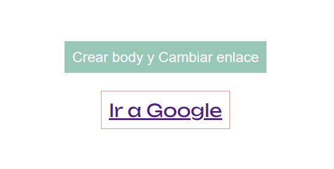
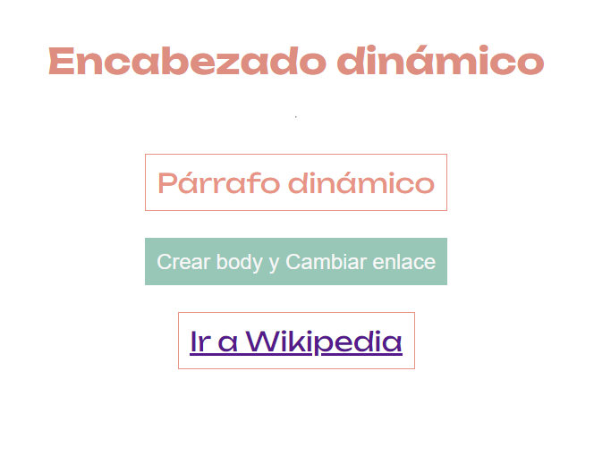

# Construccion Del DOM de forma dinámica
Se trata de construir elementos Html
de forma dinámica utilizando una función de JavaScript para alterar el DOM

## Enlace

# <https://esmeldy.github.io/ConstruccionDelDom/>

#### Antes

#### Después

